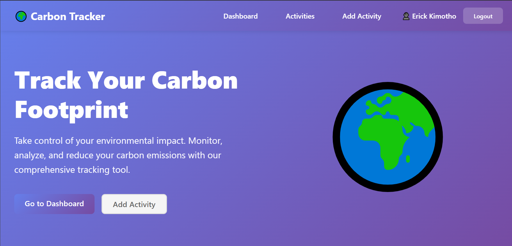
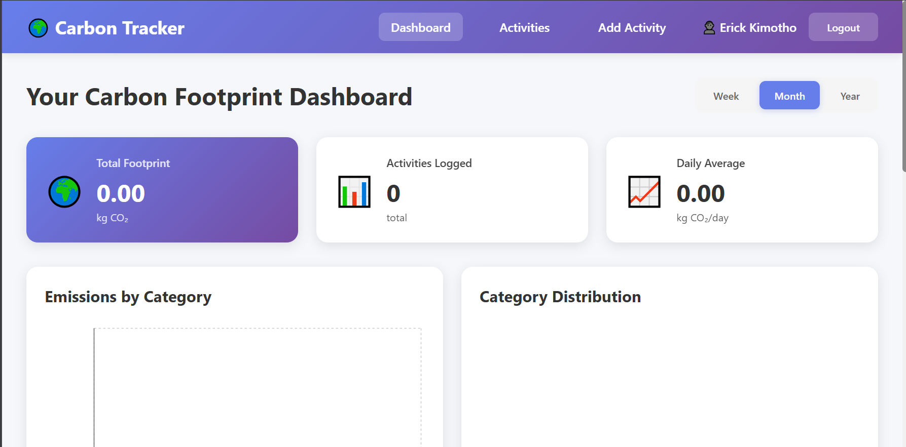
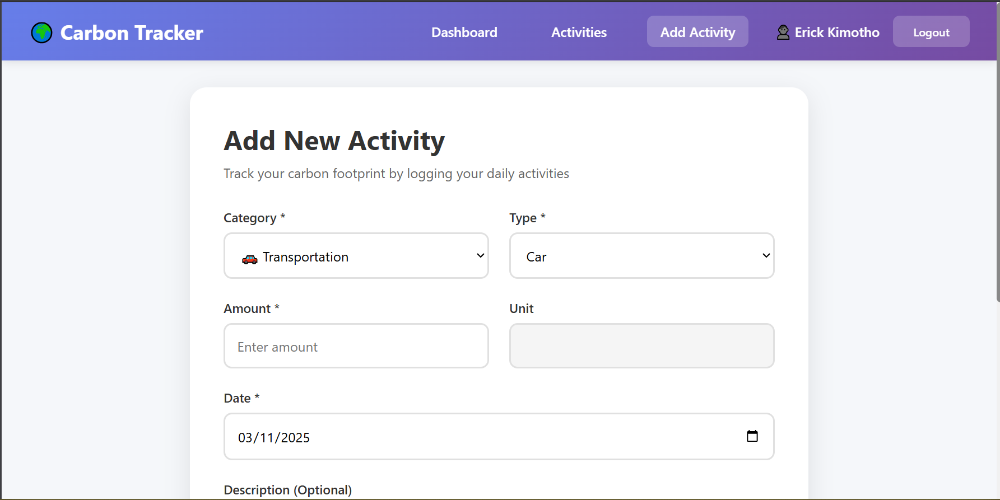
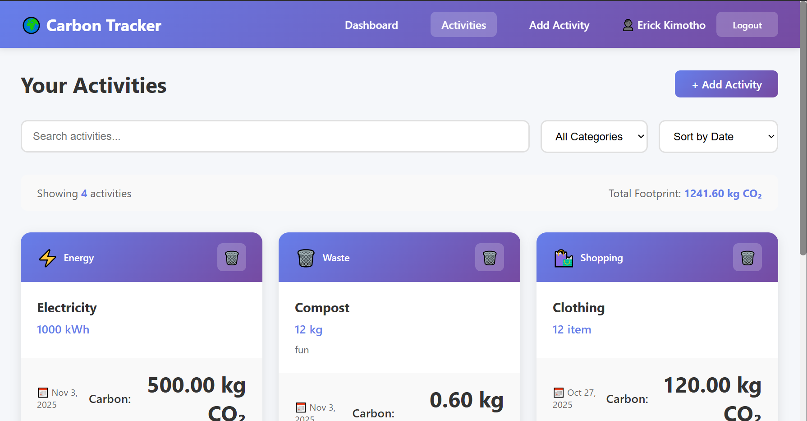

# 🌍 Carbon Footprint Tracker

A comprehensive web application that helps users track, analyze, and reduce their carbon footprint through detailed activity logging and insightful analytics.

**Live Demo:** [https://carbon-tracking-flax.vercel.app/](https://carbon-tracking-flax.vercel.app/)

## 📋 Table of Contents

- [Features](#features)
- [Tech Stack](#tech-stack)
- [Prerequisites](#prerequisites)
- [Installation](#installation)
- [Usage](#usage)
- [API Documentation](#api-documentation)
- [Project Structure](#project-structure)
- [Deployment](#deployment)
- [Screenshots](#screenshots)
- [Contributing](#contributing)
- [License](#license)

## ✨ Features

### 🔐 User Authentication
- Secure user registration and login
- JWT-based authentication
- Protected routes for authenticated users

### 📊 Activity Tracking
- Log activities across multiple categories:
  - **Transportation**: Car, bus, train, flight, motorcycle, bicycle
  - **Energy**: Electricity, natural gas, heating oil
  - **Food**: Beef, pork, chicken, fish, vegetables, dairy
  - **Waste**: General waste, recycling, compost
  - **Shopping**: Clothing, electronics, furniture
- Real-time carbon footprint calculation using industry-standard emission factors
- Date-based activity logging with descriptions

### 📈 Dashboard & Analytics
- Interactive dashboard with comprehensive statistics
- Visual charts and graphs using Recharts:
  - Bar charts for emissions by category
  - Pie charts for category distribution
- Time-range filtering (week, month, year)
- Recent activities overview
- Daily average carbon footprint calculations

### 🎯 Goal Setting & Insights
- Personalized tips for reducing carbon footprint
- Progress tracking and analytics
- Environmental impact visualization

### 📱 Responsive Design
- Mobile-friendly interface
- Clean, modern UI with intuitive navigation
- Accessible design patterns

## 🛠 Tech Stack

### Frontend
- **React 19** - Modern JavaScript library for building user interfaces
- **React Router DOM** - Declarative routing for React
- **Axios** - HTTP client for API requests
- **Recharts** - Composable charting library built on React components
- **CSS3** - Custom styling with responsive design

### Backend
- **Node.js** - JavaScript runtime for server-side development
- **Express.js** - Fast, unopinionated web framework
- **MongoDB** - NoSQL database for data storage
- **Mongoose** - MongoDB object modeling for Node.js
- **JWT** - JSON Web Tokens for authentication
- **bcryptjs** - Password hashing library

### Development Tools
- **Create React App** - Build setup for React applications
- **Nodemon** - Automatic server restart during development
- **ESLint** - Code linting for React
- **Git** - Version control

## 📋 Prerequisites

Before running this application, make sure you have the following installed:

- **Node.js** (v16 or higher) - [Download here](https://nodejs.org/)
- **npm** (comes with Node.js) or **yarn**
- **MongoDB** - [Download here](https://www.mongodb.com/try/download/community)
- **Git** - [Download here](https://git-scm.com/)

## 🚀 Installation

### 1. Clone the Repository

```bash
git clone https://github.com/your-username/carbon-footprint-tracker.git
cd carbon-footprint-tracker
```

### 2. Backend Setup

```bash
# Navigate to server directory
cd server

# Install dependencies
npm install

# Create environment file
cp .env.example .env
```

Edit the `.env` file with your configuration:

```env
PORT=5000
MONGODB_URI=mongodb://localhost:27017/carbon-footprint-tracker
JWT_SECRET=your-super-secret-jwt-key-here
CLIENT_URL=http://localhost:3000
```

### 3. Frontend Setup

```bash
# Navigate to client directory
cd ../client

# Install dependencies
npm install
```

### 4. Database Setup

Make sure MongoDB is running on your system:

```bash
# On macOS with Homebrew
brew services start mongodb/brew/mongodb-community

# On Windows
net start MongoDB

# On Linux
sudo systemctl start mongod
```

## 🎯 Usage

### Development Mode

1. **Start the Backend Server:**

```bash
cd server
npm run dev
```

The server will start on `http://localhost:5000`

2. **Start the Frontend Application:**

```bash
cd client
npm start
```

The React app will open in your browser at `http://localhost:3000`

### Production Build

1. **Build the Frontend:**

```bash
cd client
npm run build
```

2. **Start the Backend:**

```bash
cd server
npm start
```

## 📚 API Documentation

### Authentication Endpoints

#### POST `/api/auth/register`
Register a new user account.

**Request Body:**
```json
{
  "username": "johndoe",
  "email": "john@example.com",
  "password": "securepassword"
}
```

**Response:**
```json
{
  "token": "jwt-token-here",
  "user": {
    "id": "user-id",
    "username": "johndoe",
    "email": "john@example.com"
  }
}
```

#### POST `/api/auth/login`
Authenticate user login.

**Request Body:**
```json
{
  "email": "john@example.com",
  "password": "securepassword"
}
```

### Activity Endpoints

#### GET `/api/activities`
Get all activities for authenticated user.

**Query Parameters:**
- `startDate` (optional): Filter activities from this date
- `endDate` (optional): Filter activities until this date
- `category` (optional): Filter by specific category

**Response:**
```json
[
  {
    "_id": "activity-id",
    "category": "transportation",
    "type": "car",
    "amount": 50,
    "unit": "km",
    "carbonFootprint": 10.5,
    "date": "2024-01-15T00:00:00.000Z",
    "description": "Daily commute"
  }
]
```

#### POST `/api/activities`
Create a new activity.

**Request Body:**
```json
{
  "category": "transportation",
  "type": "car",
  "amount": 50,
  "unit": "km",
  "description": "Daily commute",
  "date": "2024-01-15"
}
```

#### GET `/api/activities/statistics`
Get carbon footprint statistics.

**Query Parameters:**
- `startDate` (optional): Start date for statistics
- `endDate` (optional): End date for statistics

**Response:**
```json
{
  "total": 150.5,
  "byCategory": [
    {
      "_id": "transportation",
      "totalFootprint": 75.2,
      "count": 10
    }
  ]
}
```

#### GET `/api/activities/emission-factors`
Get all emission factors used for calculations.

## 📁 Project Structure

```
carbon-footprint-tracker/
├── client/                          # React frontend
│   ├── public/
│   │   ├── index.html
│   │   ├── favicon.ico
│   │   └── manifest.json
│   ├── src/
│   │   ├── components/
│   │   │   ├── Navbar.js
│   │   │   └── PrivateRoute.js
│   │   ├── pages/
│   │   │   ├── Home.js
│   │   │   ├── Login.js
│   │   │   ├── Register.js
│   │   │   ├── Dashboard.js
│   │   │   ├── Activities.js
│   │   │   └── AddActivity.js
│   │   ├── services/
│   │   │   └── api.js
│   │   ├── styles/
│   │   │   ├── Home.css
│   │   │   ├── Dashboard.css
│   │   │   └── ...
│   │   ├── utils/
│   │   │   └── authContext.js
│   │   ├── App.js
│   │   └── index.js
│   ├── package.json
│   └── README.md
├── server/                          # Node.js backend
│   ├── config/
│   │   └── db.js
│   ├── controllers/
│   │   ├── authController.js
│   │   └── activityController.js
│   ├── middleware/
│   │   └── auth.js
│   ├── models/
│   │   ├── User.js
│   │   └── Activity.js
│   ├── routes/
│   │   ├── auth.js
│   │   └── activities.js
│   ├── server.js
│   ├── package.json
│   └── .env
├── README.md
└── screenshots
```

## 🚀 Deployment

### Backend Deployment

1. **Environment Variables:**
   Set the following environment variables in your deployment platform:
   ```
   PORT=5000
   MONGODB_URI=your-mongodb-connection-string
   JWT_SECRET=your-production-jwt-secret
   CLIENT_URL=your-frontend-url
   ```

2. **Database:**
   - Use MongoDB Atlas for cloud database
   - Update `MONGODB_URI` with your Atlas connection string

3. **Deployment Platforms:**
   - **Heroku**: Connect your GitHub repo and deploy
   - **Railway**: Import from GitHub and deploy
   - **Render**: Connect repository and deploy
   - **Vercel**: For serverless deployment

### Frontend Deployment

1. **Build the Application:**
   ```bash
   cd client
   npm run build
   ```

2. **Deployment Platforms:**
   - **Vercel**: Connect GitHub repo, set build command to `npm run build`
   - **Netlify**: Drag & drop build folder or connect GitHub
   - **GitHub Pages**: Use `gh-pages` package for deployment

### Environment Configuration

Create production environment files:

**client/.env.production**
```
REACT_APP_API_URL=https://your-backend-url.com/api
```

**server/.env.production**
```
NODE_ENV=production
PORT=5000
MONGODB_URI=your-production-mongodb-uri
JWT_SECRET=your-production-jwt-secret
CLIENT_URL=https://your-frontend-url.com
```

## 📸 Screenshots

### Home Page

*Landing page showcasing app features and call-to-action*

### Dashboard

*Main dashboard with carbon footprint statistics and charts*

### Add Activity

*Form for logging new activities with real-time carbon calculation*

### Activities List

*List view of all logged activities with filtering options*


## 🤝 Contributing

We welcome contributions! Please follow these steps:

1. **Fork the repository**
2. **Create a feature branch:**
   ```bash
   git checkout -b feature/amazing-feature
   ```
3. **Commit your changes:**
   ```bash
   git commit -m 'Add amazing feature'
   ```
4. **Push to the branch:**
   ```bash
   git push origin feature/amazing-feature
   ```
5. **Open a Pull Request**

### Development Guidelines

- Follow the existing code style
- Write clear, concise commit messages
- Add tests for new features
- Update documentation as needed
- Ensure all tests pass before submitting PR

## 📄 License

This project is licensed under the MIT License - see the [LICENSE](LICENSE) file for details.

## 🙏 Acknowledgments

- Carbon emission factors sourced from EPA and IPCC data
- Icons provided by React Icons and Emoji
- Charts powered by Recharts library
- UI inspiration from modern web design trends

## 📞 Support

If you have any questions or need help:

- Open an issue on GitHub
- Contact the maintainers
- Check the documentation for common solutions

---


**API Documentation:** [https://carbon-footprint-tracker-api.herokuapp.com/api/docs](https://carbon-footprint-tracker-api.herokuapp.com/api/docs)

Made with ❤️ for a sustainable future
