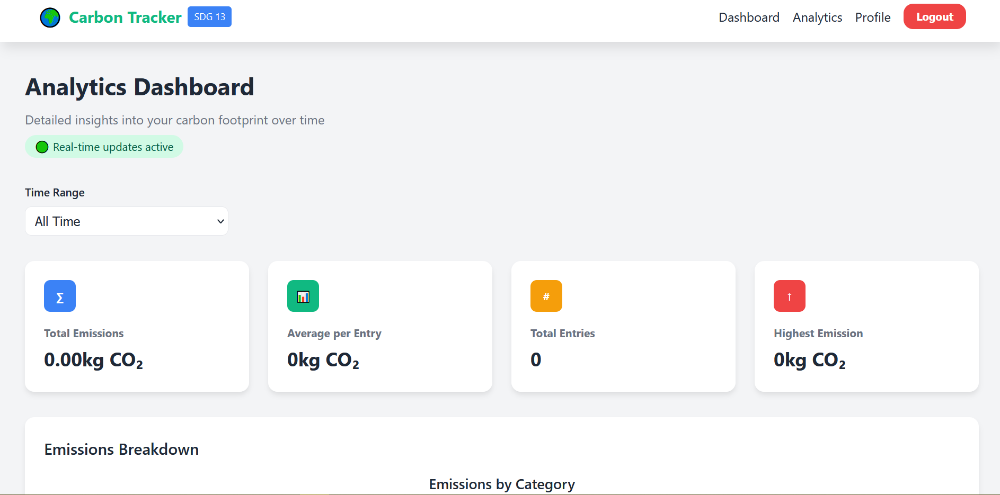
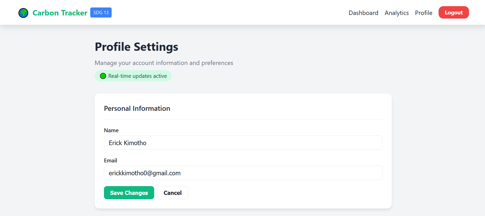

# 🌱 Carbon Footprint Tracker

A comprehensive web application for tracking and analyzing personal carbon emissions, aligned with SDG 13: Climate Action. Built with the MERN stack (MongoDB, Express.js, React, Node.js) and featuring real-time updates via Socket.IO.

## 🚀 Live Demo

[View Live Application](https://carbon-footprint-tracker-demo.vercel.app) *(Replace with your actual deployment URL)*

## 📸 Screenshots

### Dashboard

*Main dashboard showing emission tracking and real-time updates*

### Analytics Page

*Detailed analytics with charts and emission breakdowns*

### Profile Management

*User profile management and account statistics*


## ✨ Features

### 🔐 Authentication & User Management
- Secure user registration and login
- JWT-based authentication
- Protected routes for authenticated users
- Profile management with editable information

### 📊 Emission Tracking
- Track emissions across multiple categories:
  - Transportation (car, bus, train, flight)
  - Electricity consumption
  - Food consumption
  - Waste generation
- Real-time emission calculations
- Historical data tracking

### 📈 Analytics & Insights
- Comprehensive analytics dashboard
- Interactive charts and visualizations
- Category-wise emission breakdown
- Time-range filtering (week, month, year, all-time)
- Emission statistics and trends

### 🔄 Real-Time Updates
- WebSocket integration for instant updates
- Live emission data synchronization
- Real-time notifications

### 🎨 Modern UI/UX
- Responsive design for all devices
- Clean, intuitive interface
- Dark/light theme support
- Smooth animations and transitions

## 🛠️ Tech Stack

### Frontend
- **React 19** - Modern React with hooks and concurrent features
- **Vite** - Fast build tool and development server
- **React Router** - Client-side routing
- **Chart.js** - Data visualization
- **Axios** - HTTP client for API calls
- **Socket.IO Client** - Real-time communication
- **Tailwind CSS** - Utility-first CSS framework

### Backend
- **Node.js** - JavaScript runtime
- **Express.js** - Web application framework
- **MongoDB** - NoSQL database
- **Mongoose** - MongoDB object modeling
- **JWT** - JSON Web Tokens for authentication
- **bcryptjs** - Password hashing
- **Socket.IO** - Real-time bidirectional communication

## 🚀 Getting Started

### Prerequisites
- Node.js (v16 or higher)
- MongoDB (local or cloud instance)
- npm or yarn package manager

### Installation

1. **Clone the repository**
   ```bash
   git clone https://github.com/your-username/carbon-footprint-tracker.git
   cd carbon-footprint-tracker
   ```

2. **Install server dependencies**
   ```bash
   cd server
   npm install
   ```

3. **Install client dependencies**
   ```bash
   cd ../client
   npm install
   ```

4. **Environment Setup**

   Create `.env` file in the server directory:
   ```env
   NODE_ENV=development
   PORT=5000
   MONGO_URI=mongodb://localhost:27017/carbon-footprint-tracker
   JWT_SECRET=your-super-secret-jwt-key-here
   CLIENT_URL=http://localhost:5173
   ```

5. **Start MongoDB**
   Make sure MongoDB is running on your system.

6. **Start the development servers**

   Terminal 1 - Start the backend server:
   ```bash
   cd server
   npm run dev
   ```

   Terminal 2 - Start the frontend development server:
   ```bash
   cd client
   npm run dev
   ```

7. **Access the application**
   Open [http://localhost:5173](http://localhost:5173) in your browser.

## 📁 Project Structure

```
carbon-footprint-tracker/
├── client/                 # React frontend
│   ├── public/
│   ├── src/
│   │   ├── components/     # Reusable components
│   │   ├── pages/         # Page components
│   │   ├── context/       # React context providers
│   │   ├── hooks/         # Custom React hooks
│   │   ├── utils/         # Utility functions
│   │   └── assets/
│   ├── package.json
│   └── vite.config.js
├── server/                 # Express backend
│   ├── controllers/       # Route controllers
│   ├── middleware/        # Custom middleware
│   ├── models/           # MongoDB models
│   ├── routes/           # API routes
│   ├── socket/           # Socket.IO handlers
│   ├── utils/            # Server utilities
│   ├── server.js         # Main server file
│   └── package.json
└── README.md
```

## 🔧 API Endpoints

### Authentication
- `POST /api/auth/register` - User registration
- `POST /api/auth/login` - User login
- `GET /api/auth/profile` - Get user profile
- `PUT /api/auth/profile` - Update user profile

### Emissions
- `GET /api/emissions` - Get user emissions
- `POST /api/emissions` - Create new emission
- `GET /api/emissions/stats` - Get emission statistics
- `DELETE /api/emissions/:id` - Delete emission

## 🌍 SDG 13 Alignment

This application contributes to **Sustainable Development Goal 13: Climate Action** by:

- **Raising Awareness**: Helping users understand their carbon footprint
- **Data-Driven Decisions**: Providing insights for reducing emissions
- **Behavioral Change**: Encouraging sustainable lifestyle choices
- **Education**: Teaching about different emission sources
- **Community Impact**: Aggregating data for broader climate insights

## 🤝 Contributing

1. Fork the repository
2. Create a feature branch (`git checkout -b feature/amazing-feature`)
3. Commit your changes (`git commit -m 'Add amazing feature'`)
4. Push to the branch (`git push origin feature/amazing-feature`)
5. Open a Pull Request

## 📝 License

This project is licensed under the ISC License - see the [LICENSE](LICENSE) file for details.

## 🙏 Acknowledgments

- Built with ❤️ for a sustainable future
- Inspired by the urgent need for climate action
- Special thanks to the open-source community

## 📞 Contact

**Erick Kimotho**
- GitHub: [@your-username](https://github.com/your-username)
- LinkedIn: [Your LinkedIn Profile](https://linkedin.com/in/your-profile)
- Email: your.email@example.com

---

⭐ **Star this repository** if you find it helpful for your climate action journey!
